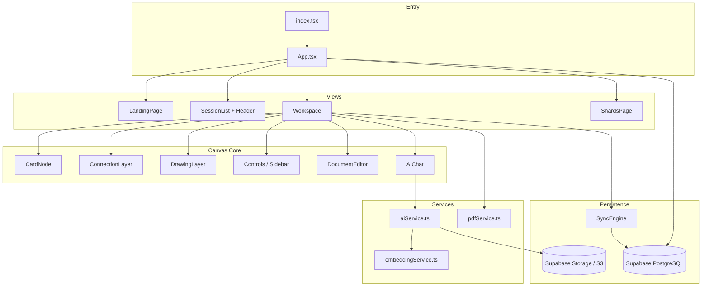

# Brainstorm — Cursor Project Summary & Code Audit

> Generated for onboarding and maintenance. Stack is **Vite + React 19 + TypeScript**, not Next.js (README is outdated).

---

## 1. What This Application Is

**Brainstorm** is a visual thinking app: ideas live as **cards** on an **infinite pannable/zoomable canvas**, connected by typed relationship lines. Users can open cards into a rich document editor, drop PDFs/images, draw on the canvas, chat with an AI that can manipulate the board, and sync sessions through **Supabase**.

### Deployment surfaces

| Surface | How it runs |
|--------|-------------|
| **Web (GitHub Pages)** | Static `dist/` from `vite build`; `.github/workflows/deploy.yml` |
| **Docker** | Multi-stage build → nginx on port 80; `docker-compose.yml` maps **8080→80** |
| **Desktop (Electron)** | `electron/main.js` loads dev server or `dist/index.html`; auto-update via `electron-updater` |
| **Local dev** | `npm run dev` → Vite on port **3000** |

### High-level architecture

---

## 2. Repository Layout (Folders)

### Root

| Path | Role |
|------|------|
| **`App.tsx`** | Root router: `landing` → `dashboard` → `workspace` → `shards`. Auth, session CRUD, Supabase fetch on login. |
| **`index.tsx`** | React 19 mount point (`#root`). |
| **`index.html`** | HTML shell: Tailwind CDN, fonts, import map (legacy), links missing `/index.css`. |
| **`types.ts`** | Domain types: cards, connections, sessions, strokes, chat, file system. |
| **`constants.ts`** | Default card sizes, colors, initial central card, collection UUIDs. |
| **`vite.config.ts`** | Dev server :3000, `base: './'` for GitHub Pages, `@` alias, optional `GEMINI_API_KEY` inject. |
| **`package.json`** | Scripts: `dev`, `build`, `desktop:*`; deps include React, Supabase, Gemini SDK, Transformers.js, jsPDF, Electron. |
| **`tsconfig.json`** | TypeScript project config. |
| **`metadata.json`** | App metadata (name/description) — likely AI Studio artifact. |
| **`README.md`** | User-facing docs (incorrectly cites Next.js 15). |
| **`CURSOR_SUMMARY.md`** | This file. |
| **`IMPLEMENTATION_PLAN_STATUS.md`** | Stale checklist from a prior plan (several items are now wrong). |
| **`OAUTH_CALLBACK_SETUP.md`** | OAuth redirect setup notes for web/Electron. |
| **`DESKTOP_UPDATE_GUIDE.md`** | Electron release/update instructions. |
| **`S3_MIGRATION_GUIDE.md`** | Storage migration documentation. |
| **`.env.example`** | `VITE_SUPABASE_*`, `GEMINI_API_KEY` template. |
| **`Dockerfile`** | Node build + nginx serve SPA. |
| **`docker-compose.yml`** | Single service `brainstorm` on port 8080. |
| **`.dockerignore`** | Docker build exclusions. |
| **`.gitignore`** | Standard ignores. |

### `components/` — UI (19 files)

Primary React UI. **`Workspace.tsx`** (~1960 lines) is the orchestrator for the canvas session.

| File | Purpose |
|------|---------|
| **`Workspace.tsx`** | Session editor: viewport pan/zoom, cards, connections, drawing, drag-drop, paste, AI chat wiring, auto-save, modals, master PDF export handler. |
| **`CardNode.tsx`** | Single card UI: title textarea, colors, fonts, image/PDF preview, per-card PDF export (html2canvas), Brainstorm (“B”) button, memo comparator. |
| **`ConnectionLayer.tsx`** | SVG connection lines with relation types (equivalence, parent/child), edge math, selection. |
| **`DrawingLayer.tsx`** | SVG pen/marker/eraser strokes with mask-based erasing. |
| **`Controls.tsx`** | Exports **`Sidebar`**: tool modes (select/pan/connect/draw), collections, file tree, zoom controls. |
| **`DocumentEditor.tsx`** | Full-screen rich editor for card docs & sidebar files: blocks (text/code/table), PDF/MD export. |
| **`FileSystem.tsx`** | Recursive folder/file tree in sidebar; drag-reorder, rename, upload. |
| **`AIChat.tsx`** | Resizable chat panel; model picker (Gemini only in UI); attachments via S3. |
| **`Header.tsx`** | Workspace/dashboard header: save status, master PDF, home, auth, sidebar toggle. |
| **`SessionList.tsx`** | Dashboard grid of sessions; AI icon/banner generation; API key modal. |
| **`LandingPage.tsx`** | Marketing/landing for logged-out users. |
| **`AuthModal.tsx`** | Email/password + Google OAuth via `auth-service`. |
| **`APIKeyModal.tsx`** | BYOK storage UI (OpenAI, Anthropic, Gemini). |
| **`CreationModal.tsx`** | Create folder/file/collection naming. |
| **`CollectionSelectorModal.tsx`** | Pick collection when creating a card (multi-collection sessions). |
| **`FolderSelectorModal.tsx`** | Pick folder when placing a file on canvas. |
| **`HelpGuide.tsx`** | In-app help overlay. |
| **`SummaryModal.tsx`** | Session summary UI (print-oriented). |
| **`ShardsPage.tsx`** | Electron “Shards” feature toggles (global clip shortcuts). |

### `services/` — Business logic

| File | Purpose |
|------|---------|
| **`aiService.ts`** | `generateRelatedIdeas` (Brainstorm button), `getChatResponse` (multi-provider + agent JSON + RLM `search_cards`/`read_card`), `generateSessionIcon` / `generateSessionImage` (Imagen via Gemini). |
| **`embeddingService.ts`** | On-device RAG: `@xenova/transformers` (`all-MiniLM-L6-v2`), in-memory vectors, `syncCards`, `searchSimilar`, `getCardById`. |
| **`pdfService.ts`** | `generateMasterPDF`: cluster cards by connectivity, order narrative, jsPDF export. **`extractTextFromContent` format mismatch** (see audit). |

### `lib/`

| File | Purpose |
|------|---------|
| **`supabase.ts`** | Supabase client (`VITE_SUPABASE_*`), `uploadFileToS3` → `workspace-files` bucket public URLs. |

### `src/` — Partial duplicate / integration layer

| Path | Purpose |
|------|---------|
| **`src/App.tsx`** | **Dead/orphan snippet** — incomplete `handleCreateSession` only; **not** used by `index.tsx`. |
| **`src/utils/mappers.ts`** | Maps Supabase rows → `Session` for dashboard list load. |
| **`src/integrations/supabase/auth-service.ts`** | Auth helpers: password, OTP, Google OAuth with Electron redirect to `callback-electron.html`. |
| **`src/integrations/supabase/sync-engine.ts`** | Debounced batch upsert/delete for sessions, cards, connections, collections, file_system_nodes. |
| **`src/integrations/supabase/hooks/use-workspace.ts`** | Hook: load session from DB, subscribe sync state, `saveWorkspace` → SyncEngine. |
| **`src/integrations/supabase/utils/tree-transformer.ts`** | Flatten/rebuild file system tree for Supabase `parent_id` rows. |

### `utils/`

| File | Purpose |
|------|---------|
| **`debugLog.ts`** | Dev-only `debugLog`; errors always logged. |

### `electron/`

| File | Purpose |
|------|---------|
| **`main.js`** | Electron window, dev/prod URL, auto-updater, global shortcuts (`Ctrl+Shift+C/S`) for Shards. **Security:** `nodeIntegration: true`, `contextIsolation: false`. |

### `public/`

| File | Purpose |
|------|---------|
| **`brainstorm-logo.png` / `.svg`** | Branding / favicon. |
| **`callback.html`** | Web OAuth return: exchanges hash tokens with Supabase. |
| **`callback-electron.html`** | Electron OAuth return page. |

### `.github/workflows/`

| File | Purpose |
|------|---------|
| **`deploy.yml`** | CI: `npm ci` → `vite build` with secrets → GitHub Pages deploy. |

### `scripts/`

| File | Purpose |
|------|---------|
| **`migrate_to_s3.js`** | One-off/helper migration script for S3 storage (not part of runtime app). |

---

## 3. Feature → Code Map

| Feature | Primary location |
|---------|------------------|
| Infinite canvas pan/zoom | `Workspace.tsx` — viewport state, wheel handler, transform on card layer |
| Cards (create/move/style/color) | `Workspace.tsx`, `CardNode.tsx`, `constants.ts` |
| Connections (types, colors, dashed) | `ConnectionLayer.tsx`, `types.ts` (`RelationType`, `ConnectionStyle`) |
| Double-click → document | `Workspace.tsx` → `DocumentEditor.tsx` via `card-{id}` pseudo file |
| Per-card PDF | `CardNode.tsx` — html2canvas + jsPDF |
| Per-document PDF/MD | `DocumentEditor.tsx` |
| **Master PDF** | `Header.tsx` button → `Workspace.handleExportMasterPDF` → `pdfService.generateMasterPDF` |
| Brainstorm / related ideas | `CardNode` → `Workspace.handleGenerateAI` → `aiService.generateRelatedIdeas` |
| AI chat + agent actions | `AIChat.tsx` → `Workspace.handleSendMessage` → `aiService.getChatResponse` + JSON action parser in Workspace |
| On-device vector search | `embeddingService.ts`; synced from `Workspace` card effect |
| Drag/drop & paste files/images | `Workspace.tsx` (`handleDrop`, paste listener) |
| Drawing (pen/marker/eraser) | `DrawingLayer.tsx`, stroke state in `Workspace` |
| Sidebar file system | `Controls.tsx` / `FileSystem.tsx` |
| Collections | `CollectionSelectorModal`, sidebar in `Controls.tsx` |
| Auth | `AuthModal.tsx`, `auth-service.ts`, `App.tsx` |
| Session persistence | `App.tsx` fetch; `use-workspace` + `SyncEngine` per session |
| Shards (Electron clips) | `ShardsPage.tsx`, shortcuts in `electron/main.js` |

---

## 4. Data Model (Supabase)

Inferred tables from code:

- **`profiles`** — user profile rows (upserted on session create)
- **`sessions`** — name, viewport, strokes (JSON), thumbnail, icon, `last_modified`
- **`cards`** — position, text, `content` (JSONB), style, image URL, `collection_id`
- **`connections`** — `from_id`, `to_id`, style, color, `relation_type`
- **`collections`** — per-session named groups
- **`file_system_nodes`** — flat rows → tree via `tree-transformer`
- **Storage bucket `workspace-files`** — public uploads

**Not persisted in DB (gaps):**

- **`chatHistory`** — only in React state / `App` session object; `use-workspace` loads `[]`; no table writes found
- **Chat** may be lost on refresh

---

## 5. Key Runtime Flows

### Session open

1. `App.tsx` selects session → renders `Workspace` with `session` prop.
2. `useWorkspace(session.id)` loads DB snapshot and hydrates `SyncEngine`.
3. Local state mirrors session; debounced auto-save (500ms) calls `onSave` + `saveWorkspace`.

### AI chat (agentic)

1. User message → truncated board context (50-char snippets only).
2. `getChatResponse` may loop on `search_cards` / `read_card` via embedding service.
3. Response parsed for `{ "actions": [...] }` in `Workspace` — create/update/delete/connect cards.
4. **Gap:** `search_cards` / `read_card` run in `aiService` but **create/update/delete/connect only run in Workspace** after the model returns.

### Brainstorm button

1. Requires Gemini key (`ensureGeminiKey`).
2. `generateRelatedIdeas` → new cards in a ring + dashed connections to source.

---

## 6. Code Audit — Weaknesses & Poor Judgment Calls

Severity: **Critical** / **High** / **Medium** / **Low**

### Critical

1. **Electron security model** (`electron/main.js`): `nodeIntegration: true` and `contextIsolation: false` expose Node APIs to rendered web content. Any XSS becomes full system compromise. Modern Electron apps use `contextIsolation: true`, `nodeIntegration: false`, and a preload bridge.

2. **API keys in `localStorage`** (`Workspace`, `SessionList`): OpenAI/Anthropic/Gemini keys are stored in plaintext, scoped per user id but still extractable via XSS or physical access. Acceptable for a BYOK hobby app; not for shared machines.

3. **Anthropic “dangerous direct browser access”** (`aiService.ts`): Header `anthropic-dangerous-direct-browser-access: true` bypasses CORS policy — keys are exposed in the browser network tab and to any malicious script.

### High

4. **Master PDF “doesn’t work” — root cause likely content format** (`pdfService.ts` `extractTextFromContent`):
   - `DocumentEditor` stores **`DocBlock[]`** with top-level `text` on each block.
   - Extractor expects **Slate-like** `node.children[].text`.
   - Result: PDF exports **titles only**, empty body for edited cards → appears broken.
   - **Fix:** Parse `DocBlock` (`node.text`), code blocks, tables; include image/PDF cards in appendix.

5. **`handleSendMessage` always requires Gemini key** (`Workspace.tsx` ~820): Even if user selects GPT/Claude in UI, `ensureGeminiKey()` throws before send. **AIChat only lists Gemini** — OpenAI/Claude paths in `aiService` are dead code from UI.

6. **Chat history not persisted**: Lost on reload; `mapSessionData` and `use-workspace` force `chatHistory: []`.

7. **README / marketing stack mismatch**: Claims Next.js 15 + Tailwind build; actual app uses Vite + **Tailwind CDN** in `index.html`. Misleading for contributors and deploy expectations.

8. **`src/App.tsx` orphan**: Duplicate/incomplete logic; risks confusion if someone imports it later.

9. **New session DB seeding**: `handleCreateSession` inserts `sessions` row only; initial cards/collections/files rely on first auto-save. Race: open workspace before save → possible empty canvas or RLS errors.

10. **`content` deep equality in SyncEngine** (`sync-engine.ts` line 230): `last.content !== card.content` — object/array reference compare fails to detect in-place mutations; can skip saves.

### Medium

11. **Full-session upsert every 500ms** (`use-workspace` `saveWorkspace`): Queues **all** cards and connections on any change. Works but O(n) per keystroke/drag frame (debounced). Expensive at scale.

12. **Truncated AI context** (`Workspace` ~836): 50-char snippets; model often lacks `card.content` unless it uses `search_cards`/`read_card`. Contradicts README “full canvas awareness.”

13. **AI action JSON parsing is fragile**: Regex `\{[\s\S]*"actions"[\s\S]*\}` — fails on multiple JSON blobs or extra braces; no schema validation; invalid `fromId`/`toId` silently skipped.

14. **`IMPLEMENTATION_PLAN_STATUS.md` is stale**: Claims master PDF, spatial nav, CardNode memo issues absent — several are implemented now.

15. **Missing `index.css`**: Referenced in `index.html` but no CSS file in repo → 404.

16. **`sharp` in `package.json`**: Native Node image lib unused in browser bundle; bloats install (may be accidental dep).

17. **Import map in `index.html`**: ESM CDN mappings for React/Supabase while Vite bundles them — redundant, confusing.

18. **Supabase `null as any`** (`lib/supabase.ts`): When unconfigured, runtime errors are possible instead of typed optional client.

19. **Demo login without Supabase** (`App.tsx`): Sets mock user but session create still requires real user for DB — half-working demo path.

20. **Public S3 URLs** (`uploadFileToS3`): `public/` prefix + `getPublicUrl` — all uploads world-readable if bucket policy allows.

21. **Realtime subscription unused** (`use-workspace`): Logs “refresh advised” but does not merge remote changes — multi-tab editing can overwrite.

22. **Strokes in session JSON**: Large stroke arrays in `sessions.strokes` can bloat rows; no pagination.

### Low

23. **`CardNode` memo** omits `card.content` in comparator — document edits may not refresh canvas preview until another field changes (image/fileName were added).

24. **`JSON.stringify` style compare** in memo/sync — order-sensitive, minor perf cost.

25. **Verbose inline comments** in `Workspace.tsx` (tutorial-style) — noise for maintainers.

26. **`generateId` vs `crypto.randomUUID`**: Mixed ID strategies (`DocumentEditor` uses short random ids for blocks).

27. **GitHub Actions `GEMINI_API_KEY`**: Inlined at build via `vite.config` `define` — not used by current `aiService` (BYOK only) but could leak into bundle if referenced.

28. **Docker port docs**: README says `localhost:3000`; compose uses **8080**.

---

## 7. Master PDF — Specific Diagnosis

| Symptom | Likely cause |
|--------|----------------|
| PDF downloads but body empty | `extractTextFromContent` incompatible with `DocBlock[]` |
| Only “Central Idea” titles | Cards never had `content` filled |
| Silent failure | `alert` only on throw; empty clusters still produce PDF |
| Image/PDF cards missing | Master export ignores `card.image` / attachments |

**Recommended fix order:**

1. Update `extractTextFromContent` to handle `DocBlock[]` (and string/HTML fallbacks).
2. Add appendix section for media cards and orphan clusters.
3. User feedback: toast with page/section count after generation.

---

## 8. Suggested Priorities (If Hardening)

1. Fix master PDF content extraction + UX feedback.
2. Persist `chatHistory` (table or `sessions.chat_history` JSONB).
3. Harden Electron (`contextIsolation`, preload).
4. Align README with Vite stack; remove dead `src/App.tsx`.
5. Granular save: only queue dirty cards (Workspace already has refs; SyncEngine supports it).
6. Unify AI entry: don’t require Gemini when using OpenAI; or expose all models in `AIChat`.
7. Add `card.content` to `CardNode` memo compare.

---

## 9. NPM Scripts Quick Reference

| Script | Command |
|--------|---------|
| Dev web | `npm run dev` |
| Production build | `npm run build` |
| Preview build | `npm run preview` |
| Desktop dev | `npm run desktop:dev` |
| Desktop package | `npm run desktop:build` |
| Desktop publish | `npm run desktop:publish` |

---

## 10. Environment Variables

| Variable | Used by |
|----------|---------|
| `VITE_SUPABASE_URL` | `lib/supabase.ts` |
| `VITE_SUPABASE_ANON_KEY` | `lib/supabase.ts` |
| `VITE_ELECTRON_OAUTH_REDIRECT_ORIGIN` | `auth-service.ts` (Electron Google sign-in) |
| `GEMINI_API_KEY` | `vite.config.ts` `define` (optional build-time; BYOK preferred in app) |

---

*End of summary. For feature implementation status vs an older plan, treat `IMPLEMENTATION_PLAN_STATUS.md` as historical only—verify against this document and the codebase.*
